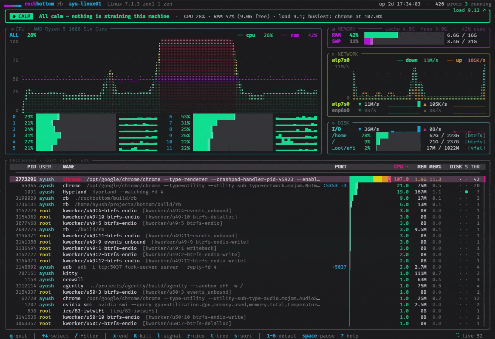

<div align="center">

```
██████╗  ██████╗  ██████╗██╗  ██╗██████╗  ██████╗ ████████╗████████╗ ██████╗ ███╗   ███╗
██╔══██╗██╔═══██╗██╔════╝██║ ██╔╝██╔══██╗██╔═══██╗╚══██╔══╝╚══██╔══╝██╔═══██╗████╗ ████║
██████╔╝██║   ██║██║     █████╔╝ ██████╔╝██║   ██║   ██║      ██║   ██║   ██║██╔████╔██║
██╔══██╗██║   ██║██║     ██╔═██╗ ██╔══██╗██║   ██║   ██║      ██║   ██║   ██║██║╚██╔╝██║
██║  ██║╚██████╔╝╚██████╗██║  ██╗██████╔╝╚██████╔╝   ██║      ██║   ╚██████╔╝██║ ╚═╝ ██║
╚═╝  ╚═╝ ╚═════╝  ╚═════╝╚═╝  ╚═╝╚═════╝  ╚═════╝    ╚═╝      ╚═╝    ╚═════╝ ╚═╝     ╚═╝
▇▆▅▄▃▂▁▁▁▁▁▁▁▁▁▁▁▁▁▁▁▁▁▁▁▁▁▁▁▁▁▁▁▁▁▁▁▁▁▁▁▁▁▁▁▁▁▁▁▁▁▁▁▁▁▁▁▁▁▁▁▁▁▁▁▁▁▁▁▁▁▁▁▁▁▁▁▁▁▁▁▁▁▁▁▁▁▁
```

</div>

<p align="center">
  <b>rb</b> — a system monitor for people who open <code>htop</code>, whisper <b>"what in god's name,"</b> and close it forever.<br>
  Every other monitor <i>shows</i> you the numbers and then leaves, like a doctor who hands you an X-ray and says "good luck." rockbottom <b>reads them for you</b> and says, slowly, kindly, like you're a spooked horse: <b>"your computer is fine, buddy."</b>
</p>

<p align="center">
  
</p>

<p align="center">
  <i>Built in type-theoretic C++26 on the <a href="https://github.com/1ay1/maya">maya</a> TUI framework — the code got a PhD so you could keep eating crayons in peace.</i>
</p>

<p align="center">
  <a href="https://github.com/1ay1/rockbottom/actions/workflows/ci.yml"></a>
  &nbsp;
  <a href="https://github.com/1ay1/rockbottom/releases/latest"></a>
</p>

<p align="center">
  <b>Grab a standalone binary</b> — no build, no deps — from the
  <a href="https://github.com/1ay1/rockbottom/releases/latest">latest release</a> or
  <a href="assets/bin"><code>assets/bin/</code></a>:
  <code>rb-linux-x86_64</code>, <code>rb-linux-arm64</code>,
  <code>rb-macos-arm64</code>, <code>rb-macos-x86_64</code>.
</p>

---

## The competition (a eulogy, delivered lovingly, at their funerals)

Let's go around the room. Everyone here has already died; they just haven't been told.

- **`top`** — shipped the year *Ghostbusters* came out and has aged like the milk
  in the fridge from that same year. A beige spreadsheet that updates with the
  urgency of a DMV and the charm of a ransom note. Ask it "is my computer okay?"
  and it stares back like a Victorian orphan. `top` isn't a tool. It's a hazing
  ritual invented by someone who peaked before the Berlin Wall came down and never
  emotionally recovered.

- **`htop`** — `top`, but they gave the ransom note *colors.* Bold move. Now it's
  a **rainbow** wall of numbers you still can't read, except festive, like a
  Christmas tree assembled by a hostage. You'll press `F5`, gasp at the tree view
  for exactly eight seconds, feel briefly like a hacker, and then close it forever
  — the same eight seconds, every time, until you die. `htop` is a screensaver you
  feel guilty about.

- **`btop`** — okay. Okay. `btop` is *stunning.* Genuinely, breathtakingly
  beautiful. It is also forty gauges, six graphs, braille fireworks, a theme
  engine, and a config file longer than your lease, and when you ask it "is
  something wrong?" it replies "here are nine hundred data points, one of them is
  the answer, figure it out, xoxo 💋." It's a fighter-jet cockpit bolted to a
  bicycle you don't know how to ride. Every dial is glorious. Not one of them tells
  you the fan noise at 2am is Chrome. Again. Like it always is.

- **`nvtop`** — fantastic tool! For the four minutes a year you remember it exists,
  *and* it's installed, *and* your GPU driver woke up on the right side of the bed.
  The other 525,596 minutes it's a `command not found` with a great personality.
  We just... put the GPU in the main app. Press `4`. It's already there. It was
  always there. You're welcome; try not to cry.

- **`bottom`** (the Rust one, `btm`) — respectfully — *respectfully* — they took
  the good name, spent a year rewriting `htop` in a language that makes you say so,
  gave it rounded corners, and called it a day. It's fine! It's genuinely fine. It
  is the most polite restatement of the problem ever committed to a crate registry.
  It shows you the numbers with *excellent memory safety* and then, like all the
  others, leaves you alone in the room with them. We took the name back, bolted a
  **rock** to it, and — this is the twist — actually answered the question. Go
  ahead and rewrite it in Rust again. We'll be over here telling a human what's
  wrong with their computer, in a sentence, out loud.

Every single one of them **shows** you the numbers. **Not one of them reads the
numbers.** That's the whole bit. That is the entire, gaping, market-sized hole in
the ground, and we reversed a truck into it, honking.

## Are you the target audience? (a diagnostic quiz)

1. When the fan spins up, do you (a) inspect the process tree, or (b) sniff the air
   and announce "something's burning" to an empty room?
2. Is "have you tried turning it off and on again" not a joke to you, but your
   *entire IT department*, its mission statement, and its only employee?
3. Have you ever killed the wrong process with total confidence, immediately
   followed by a regret so pure and so deep it echoed?
4. Do you believe "the cloud" is a place, and that it has weather?

Answer anything other than a stunned, guilty silence and **welcome home.** You are
precisely who we built this for. We are not mad. We are *proud.* You made it this
far into a README — that's further than you made it into `htop`.

## The problem, stated plainly

`htop` and `btop` are beautiful and `top` is a war crime, but they all commit the
same original sin: they answer "**is my computer okay?**" with a cheerful,
booming *"you figure it out, champ!"* and then whistle out of the room.

So you stare. You nod, sagely, understanding nothing. You develop a deep and
religious fear of the numbers. Eventually you pick a process at random, kill it,
and either the problem vanishes (you're a wizard) or your audio dies until the
next reboot (you are not a wizard, and you never were). **This is not a system
monitor. This is a hostage negotiation, and the graphs are the ransom demand.**

## The fix: we read it for you

rockbottom employs, at great personal expense, a little guy whose entire job is to
stare at all that garbage, turn to you, and deliver exactly one (1) sentence:

```
╭──────────────────────────────────────────────────────────────╮
│ ▲ Working hard — CPU is heavily loaded   chrome (pid 4160) …  │
╰──────────────────────────────────────────────────────────────╯
```

That's the **verdict.** It's color-coded, so even if you cannot read — no judgment,
you clearly got this far on vibes and shape-recognition alone — the *color* tells
you everything:

- 🟢 **Calm** — it's fine. Put the fire extinguisher down. Step away from the fire
  extinguisher.
- 🟡 **Busy** — something is working. It is *allowed* to. Unclench.
- 🟠 **Stressed** — okay, *now* you may look at the thing we already highlighted in
  red for you. Only now. Good.
- 🔴 **Critical** — this is a "close some tabs" situation. You have too many tabs.
  You have always had too many tabs. At this point it isn't a habit, it's a
  personality, and we love that for you, but close them.

And the process actually doing the crime? We slap a fat `»` on it and paint it red,
so you don't have to walk down the list pointing at each row whispering *"is it
you?? is it YOU???"* like a detective who peaked in a kindergarten production of
*Clue.* **It's Chrome.** It's *always* Chrome. It was Chrome before you finished
reading the question. `htop` knew, and `htop` said nothing, because `htop` is a
coward.

**You read the one sentence. You know. That's the app.** Everything below this line
exists purely for the two (2) days a year you feel dangerously brave.

## Press a number, get the whole story (the detail panes)

Every panel has a **full-screen drill-down** that carries *more raw detail than
htop, btop, nvtop, and the polite Rust fellow combined* — and then, unlike every
last one of them, has the basic decency to **read it for you** at the bottom. Hit a
number (or just *click the panel*, you animal) and rockbottom throws the doors
open: a system strip up top (host / kernel / uptime / process census) and, at the
end, a plain-language verdict, so you never once leave a screen squinting at digits
going *"…so what?"*

- **`1` CPU** — a big load-over-time mountain range with an actual y-axis (revolutionary),
  live total + iowait bars, and the 1/5/15 load averages **interpreted against your
  core count** — as in "oversubscribed — tasks are waiting for a free core,"
  because `htop` will proudly show you `load average: 12.4` and then let you just
  *feel things* about it, alone, forever. Plus package temp, a **distribution
  strip** (busiest / quietest / median / average / spread / active cores — it will
  personally rat out a single-threaded hog pinning one poor core to the wall), and
  **every core** as its own labelled meter with its live clock speed.

- **`2` MEMORY** — the usage-trend graph (spot the leak *before* the OOM killer
  visits), a real physical breakdown (used / cache / buffers / available) with the
  *available* verdict that's the only one that actually matters, the full swap saga
  with a thrash detector, the kernel's PSI memory-pressure numbers, **and the
  top memory-hungry processes right there in the pane** — so you're not spelunking
  through a table sorted by hand like it's 1997 and you're waiting for a CD to burn.

- **`3` NETWORK** — an all-interfaces aggregate line (total down/up, lifetime bytes,
  links up), then **every interface** with live rx/tx sparklines, lifetime totals,
  a burst detector, and up/down state. Feel like a hacker in a movie. You earned it.

- **`4` GPU** — **it replaces `nvtop` outright, and it's already installed, because
  it's simply here, existing, at all times, unlike `nvtop`.** Utilisation-over-time
  graph, core + VRAM meters, a full telemetry strip (temperature, power draw vs
  limit, core & memory clocks, fan, perf-state, NVENC/NVDEC encode/decode load), the
  processes actually squatting on VRAM, and a verdict ("▲ VRAM is nearly full" /
  "pinned at full load — this is your bottleneck"). Works with NVIDIA
  (`nvidia-smi`), AMD (`amdgpu` sysfs), and Intel; whatever your card refuses to
  cough up is quietly left out instead of shown as a sad `N/A`. Multiple GPUs stack.

- **`5` DISK** — system-wide read/write sparklines, I/O pressure with a bottleneck
  verdict, **every filesystem** with its backing device, free space, used/size,
  fstype, and a fullness meter, the fullest-mount callout, and the **processes
  actually driving the disk right now** — so you can finally meet the program
  sanding your SSD down to a nub.

- **`6` / `Enter` PROCESS** — drill into the selected process: full command line,
  cpu + memory bars, **its rank against every other process on the machine** (so you
  instantly know if it's *the* hog — "#1 CPU consumer right now" — instead of
  guessing), disk read/write, thread count, a *plain-language* run-state ("◆
  uninterruptible — wedged on I/O, can't even be killed," not a cryptic `D` you'll
  Google, understand for nine seconds, and forget forever), owner, and its listening
  ports. `x`/`K` still end it from right here; `↑↓` walks the list.

Every pane is **responsive** (it reflows to your terminal — more core columns on a
wide screen, tighter on a small one) and **scrollable** (`↑↓` / `PgUp` / `PgDn` /
`g` / `G` / the wheel, with a live scrollbar), so no matter how dense the data or
how cramped the window, nothing clips off the edge into the void — the way it does
in, and we cannot stress this enough, *you know exactly what.* `Esc` (or a click)
closes; number keys switch panes without backing out. It's the "okay, tell me
*everything*" button — gorgeous, exhaustive, and it *still* tells you what it means.

## Everything else (for your brave days)

- **Verdict banner** — Calm / Busy / Stressed / Critical, with the guilty party
  named out loud in front of God and everyone. Public shaming, as a service, at no
  extra charge.
- **PSI pressure chips** — the Linux kernel keeps a tiny diary of how long your
  stuff sat around waiting (`/proc/pressure`). "tasks stalled on I/O 40% of the last
  10s" is the kernel *tattling on your own disk.* `htop` and `btop` are far too
  well-mannered to read someone else's diary. We are not well-mannered. We read it
  aloud, at the dinner table, in a funny voice.
- **CPU** — one big number ("am I busy?"), a fistful of little numbers ("which of my
  brains is busy?"), and a graph shaped like a mountain range that goes up when you
  do things and down when you don't. It is, functionally, a very expensive mood ring.
- **Memory** — RAM + swap meters plus the cache/available breakdown, so you can
  finally internalize the one sacred truth every other monitor lets you panic over
  daily: **"used" memory is a filthy, load-bearing lie.** Linux hoards free RAM like
  a dragon on gold; it is *supposed* to look almost full. Put the credit card down.
  You do not need more RAM. You need this paragraph, tattooed somewhere.
- **Disk** — read/write speeds and your actual drives, fullest first (btrfs
  subvolumes deduped, so you don't see the same disk nine times and briefly believe
  you own a data center). Answers "why slow?" and "am I out of room?" in one glance.
- **Network** — download ▼ and upload ▲ per interface, with adorable little graphs.
  Watch the number go up. Nod. You are basically in a heist film now.
- **Processes** — pick things, filter things, and **kill** things. The loudest
  offender comes pre-highlighted, so for once in your life you kill the *right* one.
  Dots tell you who's genuinely working (●) vs. who's just napping on the disk (◆),
  so you stop executing sleeping programs on a hunch like a process-shaped serial
  killer.
- **Per-process disk I/O** — the honest, unspun "who is grinding my SSD into powder"
  number, straight from `/proc/<pid>/io`. Sort by it with `i`. The verdict even
  hands you the culprit's name when the disk is the bottleneck. (It's a backup you
  configured in 2019 and forgot about. It's fine. It loves you. It just needed to
  be seen.)
- **Ports** — which program is squatting on `:8080` like a smug little goblin
  (`:8080 +2`), so the next time you get "address already in use" you can evict the
  goblin instead of rebooting the whole machine like a frightened medieval peasant.
  Sortable with `o`.
- **Battery** — a charge chip in the corner, because sometimes "why is it slow" has
  the deeply humbling answer "it is on 3% and quietly begging for a charger."

## "Is it actually clever under the hood, or just mean?" — Both. It's both.

You get to be casual *because* the code is a paranoid genius doing your worrying for
you. Every number carries a **type that knows what it is**, so the program
*physically cannot* confuse bytes with hertz and cheerfully inform you your hard
drive runs at 3.6 gigabytes-per-second of clock speed. It won't compile. The
compiler stands in the doorway like a bouncer, looks at your unit mismatch, and says
"nah." Try getting *that* out of a bash one-liner you copied off a 2011 Server Fault
answer.

```cpp
using Bytes = Strong<BytesTag, std::uint64_t>;      // storage / memory
using Hertz = Strong<HertzTag, std::uint64_t>;      // clock speed
struct Ratio { double v; };                         // a proportion, clamped [0,1]
template <class Q> struct Rate { double per_sec; }; // Q, but per second

// The ONE legal way to turn Bytes into Bytes-per-second has a name and a
// hall pass, signed by a teacher:
constexpr ByteRate rate(Bytes delta, double dt_sec) noexcept;
```

That's why `4.2G` and `118M/s` and `3.60GHz` are *always* right — not because some
exhausted human remembered the unit at 2am, but because the **type** remembered it,
permanently, so no human ever has to again. You are safe here. The nerds have
handled it. Go outside.

## Architecture (skip this; we both know you were going to)

rockbottom is a maya **Elm-style `Program`** — pure functions, no sneaky in-place
mutations, the kind of tidy that would make your therapist weep with pride:

| Layer | Where | Role |
|-------|-------|------|
| Units | `src/core/units.hpp` | Strong dimensional types + the humanizers that translate scary numbers into `4.2G` |
| Data | `src/core/metrics.hpp` | Pure `Snapshot` value types + the almighty `Verdict` |
| Sampler | `src/core/sampler.*` + `verdict.cpp` | OS-agnostic: orchestration, cross-tick deltas, and the diagnosis engine |
| Platform | `src/core/platform/<os>/` | The one grubby room that touches the real world — `linux/` reads `/proc` + `/sys`; `darwin/` uses mach / sysctl / libproc / IOKit. CMake compiles exactly one |
| App | `src/ui/app.hpp` | `Model` + `Msg` + `update` + a pure `view` |
| Widgets | `src/ui/widgets/` | Panels, meters, graphs, and the detail panes (one file each) |

No pane hand-counts breakpoints like a savage. Every layout is *measured*: maya's
responsive toolkit (`fit_row` sheds the header **and** the footer hints as they
narrow, `pick` re-renders the detail tab bar at the richest density that actually
fits, `col` stacks the narrow-mode stat band, `solve_columns` keeps the process
table's header and rows on one width plan, `fill` sizes each graph to exactly the
height left over) means the thing measured is the thing drawn — so nothing ever
drifts off its rail at some cursed terminal size, unlike a certain gorgeous monitor
that shall remain named earlier. See maya's
[Responsive Layouts](third_party/maya/docs/15-responsive.md) guide.

`update()` ticks once a second, like a very calm heartbeat that has done a lot of
therapy. `view()` is a pure function of the state. The sampler keeps the last
sample, so every rate is a real delta and not a hopeful guess. It is genuinely
serene in here. Please take your shoes off.

## Building

Needs a C++26 compiler (GCC 15+; built on GCC 16) and CMake 3.28+. Yes, it's a
fancy compiler. The type theory has *demands.* It's an artist, and it will not be
rushed.

**Linux:**

```bash
git clone --recurse-submodules https://github.com/1ay1/rockbottom
cd rockbottom
cmake -B build -DCMAKE_BUILD_TYPE=Release
cmake --build build -j
./build/rb
```

**macOS** (Apple Silicon or Intel) builds with Homebrew GCC — the same toolchain
maya's own CI uses. That's the entire story: no Clang, no libc++ gymnastics, no
tears.

```bash
brew install gcc cmake
git clone --recurse-submodules https://github.com/1ay1/rockbottom
cd rockbottom
cmake -B build -DCMAKE_BUILD_TYPE=Release   # auto-picks Homebrew g++
cmake --build build -j
./build/rb
```

CMake hunts down Homebrew's newest `g++-N` for you (override with
`-DCMAKE_CXX_COMPILER=g++-15` or `CXX=...`). Apple's kernel headers use the C11
`_Static_assert` spelling that g++ rejects at namespace scope, so the macOS backend
aliases it to C++'s `static_assert` before any SDK header gets included
(`src/core/platform/darwin/mach_util.hpp`) — one polite line that lets plain GCC
parse all of mach / IOKit / libproc without a meltdown. Why not just use Clang?
Because Apple/LLVM libc++ *still* doesn't ship `std::move_only_function`, which maya
requires, and libstdc++ does. So GCC it is. We didn't make the rules; we just
refuse to lose to them.

Cloned it and forgot `--recurse-submodules`, you beautiful, chaotic disaster?

```bash
git submodule update --init --recursive
```

There. Fixed. You're welcome. We're not mad. We could never be mad at you.

## Keys (mostly one hand — we assume the other is holding a snack)

| Key | Action |
|-----|--------|
| `↑↓` / `j k` | pick a process (`j k` is for people who use vim and cannot physically stop telling you) |
| `/` | filter by name or pid (`Esc` un-does it the instant you inevitably typo) |
| `x` / `Del` | politely ask a process to leave (SIGTERM — it even knocks first) |
| `K` | *firmly* remove a process (SIGKILL — still asks you first; we're unhinged, not savages) |
| `y` / `n` | yes, commit the crime / no, I panicked, put it back |
| `s` | cycle sort · `c` cpu · `m` mem · `i` i/o · `n` name · `P` pid · `o` port |
| `1`–`6` / `Enter` | open a detail pane (cpu · mem · net · gpu · disk · process) |
| `↑↓` / `PgUp`/`PgDn` / `g`/`G` | scroll the detail pane (the wheel works too) |
| `p` / `Space` | pause / resume (freeze the chaos so you can point at it and go "there") |
| `?` / `h` | help, for when every key you just read immediately evaporates from your brain |
| `q` / `Esc` | leave. go outside. the grass misses you. |

**Or just use your mouse, you absolute animal.** Full mouse support, zero misses:

| Do this | Get that |
|---------|----------|
| **click a process** | selects it (no more arrow-key pilgrimages) |
| **click a column header** | sorts by it (CPU, MEM, DISK, PORT, NAME) |
| **click a panel** | opens its detail pane |
| **click a footer hint** | fires that action — `?·help`, `space·pause`, `s·sort`, `x·end`, `K·kill`, `/·filter`, `q·quit` |
| **right-click a process** | arms an end (SIGTERM — still asks first) |
| **scroll wheel** | rolls the process list (or the detail pane, if one's open) |

The click-to-row math is anchored to the layout, so a click lands on *exactly* the
row you clicked, at every terminal size. No "close enough," no "off by one," no
"why did I just kill systemd." We checked. `btop` did not check. `btop` is beautiful
and it did not check.

## Platform

**Linux and macOS.** rockbottom is a thin OS-agnostic core (the verdict engine, the
Elm loop, the strong-typed units) sitting on a **platform backend** — one directory
per OS under `src/core/platform/`, and CMake compiles exactly one. Adding an OS is
adding a directory; the verdict never changes, because the verdict is the whole
point and everything else is plumbing.

- **Linux** — reads `/proc` and `/sys` with its bare hands. Full fidelity: PSI
  pressure, per-core clocks, iowait split, per-process disk I/O, the entire buffet.
- **macOS** — talks to the kernel the native way: `host_processor_info` /
  `host_statistics64` (CPU + memory), `sysctl` (swap, uptime, model), `libproc`
  (processes + bound ports), IOKit (disk throughput, GPU, battery), `getifaddrs`
  (network). A few Linux-only signals have no macOS analogue — PSI, the iowait
  split, per-core clock — so those panes simply omit them, exactly the way the app
  already hides a GPU field your card won't report. No fake `N/A` theater. Everything
  else is there.

No ncurses, no runtime dependencies, no phoning home to sell your fan speeds to
advertisers. On Windows? Still not for you — but sincerely, genuinely, from the
bottom of our hearts: props for reading this entire thing.

## License

MIT. Do whatever you want; we are not your dad, and we would not presume. Vendored
maya is MIT too. Everybody's chill. Go be free.

---

<p align="center">
  <i>rockbottom: for when "is my computer okay?" finally deserved a real answer — and you deserved to never have to think about it again.</i>
</p>
